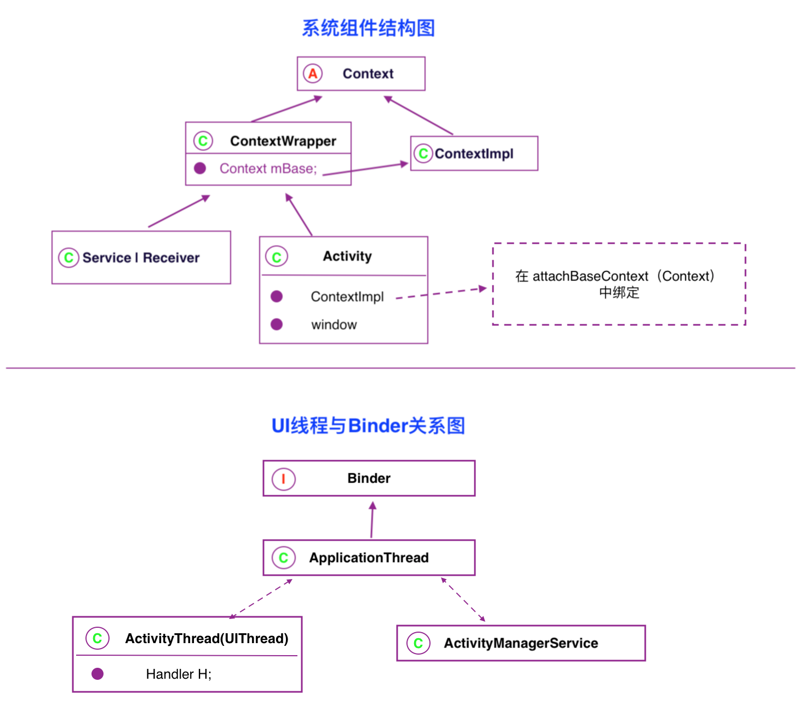
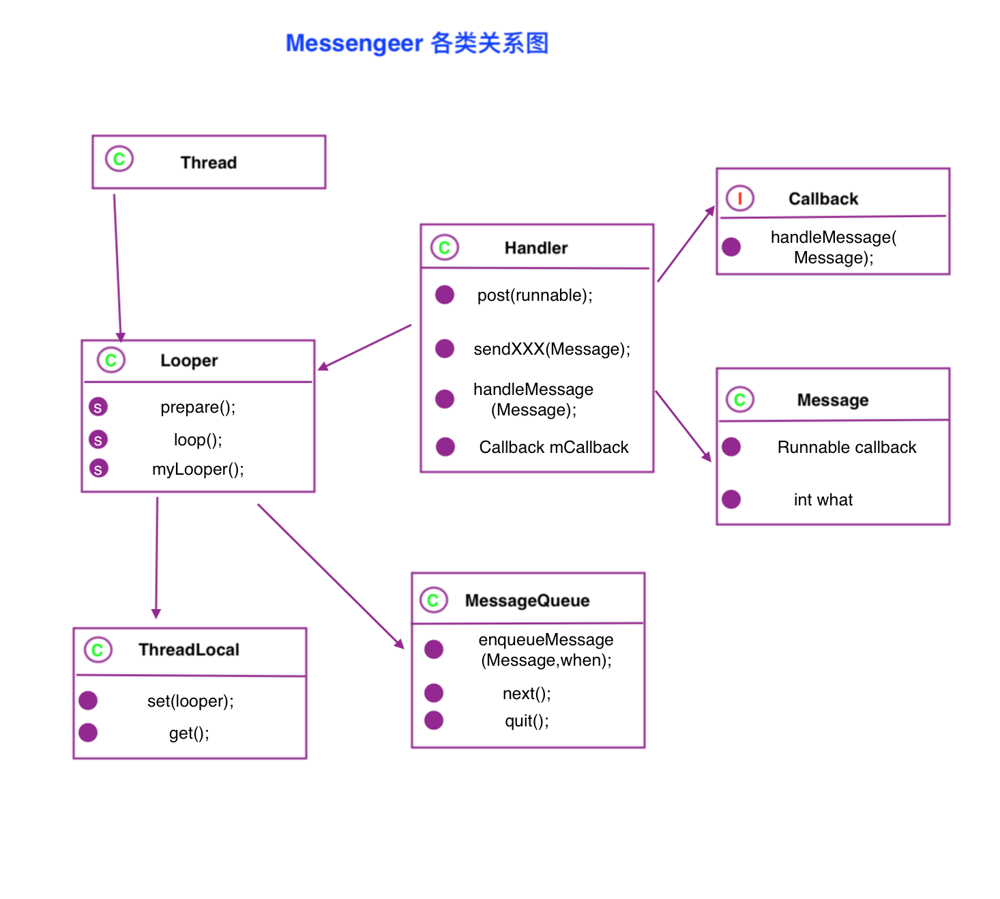
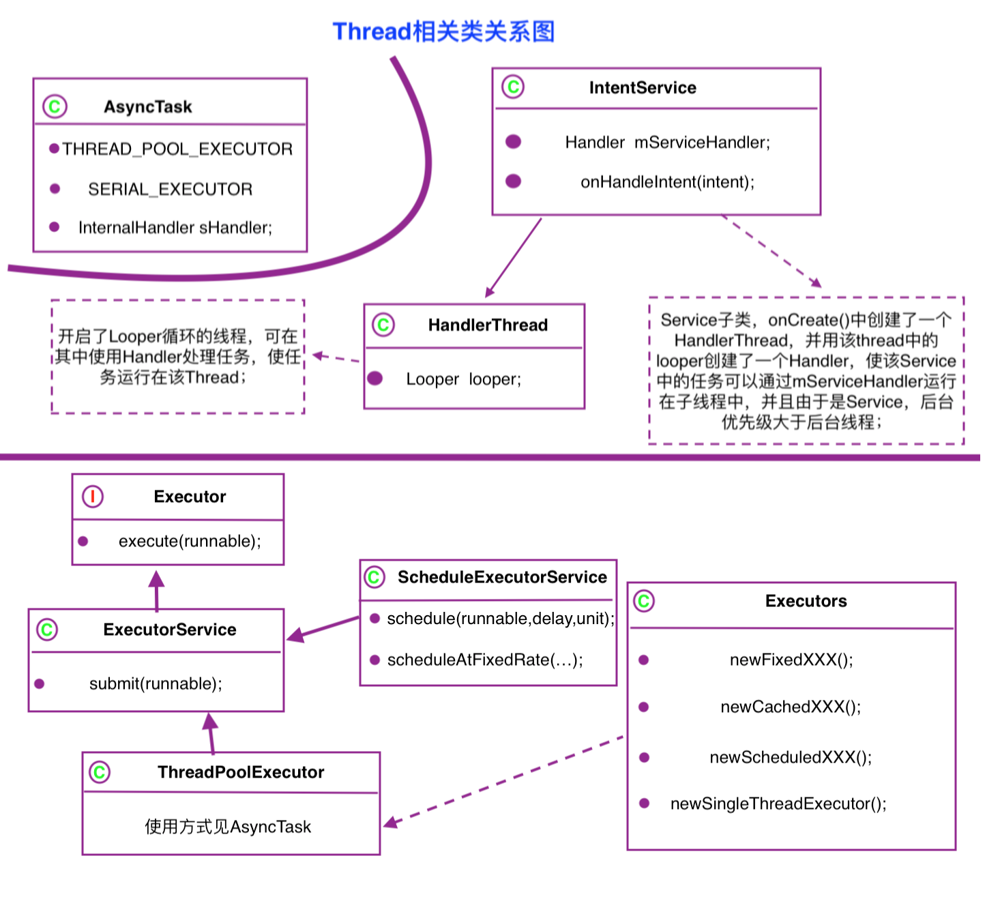

[TOC]


## Manifest 相关
#### 启动项配置
###### 启动类型：
* standard 默认
* singleTop 
* singleTask 等于`NewTask + clearTop`
* singleinstance `启动后即创建新Task，并后续启动只使用该Task`

###### TaskAffinity
> 指定Activity启动所需Task的名字
> default为packageName
> 与singleTask或allowTaskReparenting配对使用

###### hardwareAccelerated
> Activity标签中添加hardwareAccelerated属性并设置为true 为当前Activity开启硬件加速效果，解决界面卡顿问题

## intentFilter
###### action:
  `必须与rule中之一匹配，casesensitive`
###### category:
`intent中所含所有cate必须在rule中存在，没有cate则算match，因为系统默认为此类intent中添加DEAFULT Cate，所以在配置filter rule中都必须加DEFAULT`
###### data:
* 必须与rule中之一匹配
* data中URI参数必须包含scheme和host，uri前面的未指定，则该uri后面的数据无效，uri等于或长于rule中的uri则match。 
* mimeType于rule中之一匹配则match。
* `file://`与`content://`为默认的scheme

##### API中涉及
`
queryIntentActivities返回所有与Intent匹配的activity；      resolveActivity返回最佳匹配；
这两个方法中flags参数必须使用MATCH_DEFAULT_ONLY来确保返回的activity的intentFilter配置中包含DEFAULT Category 
`


## IPC
* **开启多进程:** 在manifest中为四大组件指定process
* 指定process的Name规则 `以:开头的为应用私有进程，否则为全局进程`
* 查看当前应用的进程 `adb shell ps | grep packageName`
* **UID:** 每个应用有一个唯一的UID，具有相同签名并设置shareUID一样的两个应用可以共享数据，如访问res/src下资源等，若同时还跑在同一进程，还可以共享内存数据；
* **Davik：** 每个process对应一个Davik，一个Davik有不同的内存空间，包括不通的静态数据区
* **Parcelable:** writeToParcel & CREATOR
* **Binder:** define an `AIDL`file,class will be gernerated by system,this class extend `IInterface`,and has a `Binder` implementation `Stub`,and this `Stub` has a proxy implement the gernerated class
* **IPC的几种方式** 
    * Bundle
    * File
    * Messenger `底层为AIDL，通过发送Message，Handler接收方式通信`
    * AIDL `BinderPool: 多模块AIDL都交给一个BinderPool处理，减少开销并提高开发效率`
    * ContentProvider
    * Socket 


##adb相关
 
* adb shell dumpsys activity `查看activity的任务栈`
* adb shell am start packageName/.activityName `启动某个包下的activity`
* adb disconnect | adb connect 192.168.1.1 | adb root | adb connect 192.168.1.1 | adb remount `开启root并重新挂载`
* java -jar signapk.jar platform.x509.pem platform.pk8 app-release.apk app_signed.apk `利用aosp上的系统签名文件和java签名工具对apk进行系统签名`
* adb shell ps | grep packageName `查看对应包名的应用进程`

## 事件分发 & TouchEvent
> 事件始于dispatchTouchEvent方法，该方法中检测本对象是否有onTouchListener，有则调用其onTouch方法，返回true则结束，返回false就继续调用本对象中onTouchEvent方法，该方法中会调用onClickListener的onClick方法；

##### 事件分发基本逻辑伪代码
```java
boolean dispatchTouchEvent(Event ev){
    boolean consume = false;
    if(this.onInterceptTouchEvent(ev)){
        consume=onTouchEvent(ev);
    }else{
        View child=theChildViewContainEventPoint();
        consume=child.dispatchTouchEvent(ev);
        if(!consume)
            consume=onTouchEvent(ev);
    }
    return consume;
}
```
##### Activity 的 dispatchEvent 流程
```java
boolean dispatchTOuchEvent(Event ev){
    if(ev == Down)
        事件处理者=null;
    if(事件处理者 != null)
        b=事件处理者.dispatchTouchEvent(ev);
    else 
        b=getWindow().dispatchTouchEvent(ev);
    if(!b) 
        b=onTouchEvent(ev);
    return b;
}
```
##### View 的 dispatchEvent 流程
```java
boolean dispatchTouchEvent(Event ev){
    boolean consume = false;
    if(onInterceptTouchEvent(ev)){
        consume=onTouchEvent(ev);
    }else{
        View child=childContain(ev);
        if(child.dispatchTouchEvent(ev)){  
            if(事件处理者==null){
                事件处理者=child;
            }
            consume=true;
        }else{
            consume=onTouchEvent(ev);
            }
    }
    return consume;
}
```
 
* 一旦某个View的onTouchEvent返回true，整个Event sequence的后续事件都会直接调用这个View的onTouchEvent来处理，期间一旦返回false就交给activity处理，因为此时不是在dispatchTouchEvent中处理，所以无法再传给父View处理；
* onInterceptTouchEvent默认返回false，就ViewGroup有此方法
* View的onTouchEvent方法默认返回true，除非clickable和longClickable都为false；
* disallow_intercept属性由子View为其父View设置，true则父View无法拦截event，默认false，每次Down事件触发都将会把该值恢复为默认值false


##### dispatchEvent调用顺序:
`Activity -> Window -> View`
##### TouchEvent调用顺序:
`View -> Window -> Activity`
#### 事件基本规律：
1. `down->move->up` 为一个事件sequence,一旦某个元素处理了某个事件，整个事件序列都将直接交由它处理
2. Event由父派发到子，中间可被拦截直接由当前元素处理，拦截返回true后将不会再调用拦截方法，直接将整个事件序列都交给拦截者处理
3. 处理不了的`(onTouchEvent返回false)`事件将回传给父元素的`onTouchEvent`方法处理
4. 如果某View处理了`Down`事件，却不处理后续事件，则直接回传到`Activity`处理而非父元素，该View还是可以持续收到此`Down`事件序列中的后续事件，因为该View处理`Down`事件后，此事件序列由Activity直接派发至该View，不经过该View的父View们
5. ViewGroup默认不拦截事件，View则没有`onInterceptTouchEvent`方法，收到事件直接调用`onTouchEvent(ev)`方法
6. View 的`onTouchEvent`方法当且仅当它`clickable`和`longClickable`同时为false，默认的实现中才返回false，`enable`属性只影响父View派发事件时是否考虑给它，不影响它`onTouchEvent`方法默认实现中的返回值
7. `requestDisallowInterceptTouchEvent`方法可在子元素中干预父元素的事件拦截操作，`Down`事件除外，每次`Down`事件为新事件序列的开始，会重置`requestDisallowInterceptTouchEvent`所设置的值


## View相关
#### 提前获取View大小的方法
1. Activity或View 中onWindowFocusChanged，View有实际大小将被显示时调用，会多次调用
2. `View.post(runnable)` 向消息队列尾加入一个runnable来获取view大小，此时looper将在View初始化完后调用该runnable
3. View.ViewTreeObserver中添加onGlobalLayoutListener，在onGlobalLayout方法中获取，获取大小后最好移除该listener
4. view.measure(wspec,hspec),wrap_content的spec为`MeasureSpec.makeMeasureSpec((1<<30)-1,MeasureSpec.AT_MOST);`


#### View的几个关键回调函数
1. `onDetachedFromWindow` 被从窗口移除时调用
2. `onAttachedToWindow` 被添加到窗口时调用
3. `onWindowFocusChanged` 将要显示时调用

### 自定义View
##### 自定义View的自定义属性步骤:
1. 在res/values 下创建一个XML
2. attr的format有color,reference,dimension,string,integer,boolean等


##SurfaceView
#####使用步骤
1. new surfaceView,get `holder` and add `callback`
2. add surfaceView to viewHiarachy,holder callback's `surfaceCreated` method will be invoked,init `paint` `drawThread` and `other resources` here,then `surfaceChanged` method will be invoked
3. in draw thread,obtain holder and `lockCanvas`,invoke surfaceView's `onDraw` method,then `unlockCanvas` and `post`

## Decompile
**反编译基本步骤：**
1. 用`apktool`将apk反编译成源文件，这步骤能获得配置文件manifest，应用资源和源码的smali文件
2. 将apk文件解压缩，用`dex2jar`工具将解压缩中的`classes.dex`文件转成java jar包
3. 用`jd-gui`等java反编译工具将上步骤中得到的jar包反编译成java源文件
4. 修改后使用`signapk.jar`工具重新打包成apk


## LRUCache
##### LRUCache<K,V> 使用
* put(K,V)
* get(K)
* remove(K)
* 创建时指定最大占用内存量，并重写`sizeof`方法返回计算后的value的size

##### DiskLRUCache<K,V> 
* 不存在SDK中，需自行从第三方集成


##杂项（未归类）
* dynamic-load-apk
* 在gradle 中配置 multiDex 解决应用方法总数超过 65535 的问题
* Thread.setDefaultUncaughtExceptionHandler(handler);


## 结构图表




##Messenger & Thread
#### Messenger
> `looper.quit()`中调用`messageQueue.quit()`,`messageQueue`被标记为退出后 `next()`将返回`null`，`looper`的`loop`方法中收到`null message`则跳出循环，非退出状态的`messageQueue.next()`要么返回值，无值时就阻塞

**相关类关系图：**

#### Thread
**相关类关系图：**



